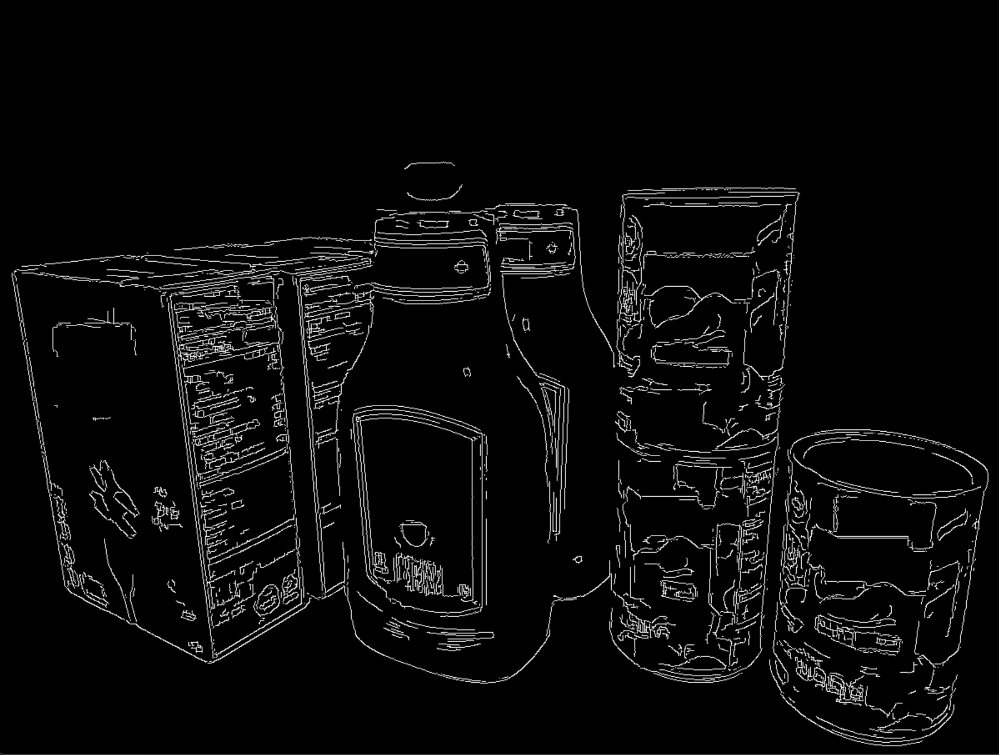

# ECE1390 Semester Project: Shopkeepr

## Description
The Shopkeepr is an inventory-tracking service that identified, counts, and monitors stock for use in grocery stores. This service tracks stock on shelves to assist stores in managing stock count to ensure consumer supplies are maintained and depletions are mitigated. By taking video or still image input, the service detects objects on shelves, identifies unique items, counts items, and track data over time of the service for store and consumer data analytics. This way the store knows when stock is usually low, when it needs to be restocked, and consumers know when optimal times are to get their items with high success rates. The input would consist of a white shelf with an arrangement of cans of soup, pasta boxes, and ketchup bottles. 

## Code Specifications
The code specifications for Shopkeepr are as follows: 
Inputs of a still image and up to a 30 fps stream of Takes in an a video with a frame rate of 30 frames per second 
Takes in multiple video feeds 
Output the live feed of 30 frames per second annotated with the statistics generated within the algorithm 
The video should be a live feed 

## Planned Approach
We think the very first goal is to be able to identify a single item and then eventually get to separate goods. Looking at a shelf, it should be able to identify Pasta Boxes, Canned Goods, and Fruits separately. Then see if we can find a way for users to train models with their own goods. After this there will be a need to find a way to keep metrics of quantities of each good and see how to keep track if a good is taken away or placed back, etc,. Maybe multiple views will be needed. 

## Timeline
| Dates | Deliverables |
| ------|-------- |
| 9/27 | Github Repository & Code Claiming |
| 10/4 | Materials gathered (Video feed method) & Individual completion of at least 20% of goal  |
| 10/11 | Further Progress 30-50  |
| 10/18 | Bare Minimum Functionality V0 |
| 10/25 | Further Progress 80% |
| 11/1 | 50-60 |
| 11/8 | V1 complete (rough model)  Everything must be attempted prior to code swap  |
| 11/15 | Debug & Test & Improve  |
| 11/29 | Debug & Test & Solidify Demo  |
| 12/9 | Present |
 

## Metrics of Success
The early success metric will be the program's ability to accurately count and identify the items that are captured in the camera feed. Essentially, we can get an updated quantity regardless of if we add, remove, or shift items in frame. Should we finish early, an additional success metric would be to set this up at an actual grocery store shelf, or a simulated shelf that we fill with items and test the accuracy of count from our program detection. Additionally, it should be able to track both items in live video as well as hand movements. 

## Pitfalls & Alternatives
If things get difficult, we could always choose to avoid video use in the project and focus primarily on frame-by-frame comparison, which would still be targeting the primary objective of the Shopkeepr, being keeping inventory and track of what is available in stock. 
One place we may expect trouble is cascaded products that are placed in line with each other. Depending on where the camera is mounted this could make identifying all objects in frame very simple or challenging, so we plan on properly setting up such that we can view all objects to some extent. Essentially, so long as we can see part of the item, we can use edge detection and tracking to keep the count updated appropriately. 

 
## Results & Final Implementations
Algorithm was split across the four of us to be hand tracking for allowing the program to know when to recheck count as a shelf can be restocked or taken from, and various forms of object recognition/detection for identifying different products found on the shelf. Bwlow is a thorough explanation of the results of each section

### Hand Tracking
Originally, this was attempted with a Neural Network to track the gesture of one hand, but it had a some of issues. It was not very accureate and it only ran off of single images without the addition of live video feed for constant monitoring.

We quickly shifted to trying an LSTM, which is a model trained to detect and recognize the endtire body, both hands, and facial features. The benefit was the use of live video as a transition from single pictures.

### Edge Detection-Based Object Counting
Upon running several methods of edge detection in the early phases of this project, we found that the image density of our "Shelf" images were too high, so any form of edge detecion yielded over-detected and noisy results like this:

Afterwards, upon realizing that Canny Edge Detection provided a denoised Edge Detection output that we wanted, we explored many options of using Edge Detection to count objects. Here is the outline of our results with this exploration:

Following this are the outputs of different steps taken to get close to the goal:

#### Sample Input:

#### Dynamic Text Blocking:
Using EasyOCR to detect text blocks on the grocery items, we averaged the colors at the endpoints of the bounding box to make a cleaner, edge-detection friendly version of the grocery items.

#### Canny Edge Detection:
This edge detection method had the perfect layout to threshold out the noise of our previous edge detection schemes, giving us an output that was like a cartoony outline of our input. From there we explored many different routes for accurate object quantification, though to varying degrees of effect.

#### Watershed Segmentation & Counting:
We attempted to use Watershed segmentation with some filtering and distance methods to split the image into foreground and background, hoping the watershed algorithm would optimally identify main color points. Though successful with the ketchup bottles, the cans and pasta boxes were too colorful which made our results relatively inaccurate and arbitrary.

#### Hough Lines & Circles:
After using Canny Edge Detection to get a good outline of the items, the hough lines were able to get decent borders around the box shapes but the hough circles were very arbitrary. Because the tuning of this function is directly based off image input, it was difficult to generalize this method to garner any usable outputs.

#### Contour Counting:
Using Canny Edge Detection along with finding the contours, we filtered out nested contours and contours of small size to get an outline of the different objects. While we successfully got an outine of the items, any further attempts to mask and process the output fell short due to time constraints. This would be a great place to pick back up our endeavors.

### Color Tracking
This was a method used primarily for object recognition via the different colors each object is, and at first, the algortihm could only detect one color at a time, between the three primary colors of the objects we chose (red for the ketchup bottle, blue for the pasta box, and brown for the onions)

Afterwards, this was updated to account for all colors, which was great but yielded some issues. The primary was an object being identified with multiple colors, and thus identified as multiple objects, and additionally the relative closeness that exists between the colors red and brown which is covered well below in the way the program assigned two labels to the rectangle on the right:

### Object Quantification & Classification
Initially, this method of object quantification was targetted using edge dtection, but after diving work further among the team, it quickly became moreso heavily involved with object classification as well. Initially, some edge detection was used for the purposes of object quantification, by using a Canny edge detection method alongside some basic dilution and erosion to help clearly outline shapes and contours of shapes. In the end, from the original sample image, 8 objects were detected, which was the number of objects in the image, but it wasn't accurate as the 8 contours were not clearly defined around the 8 products.

For object classification, the primary methods were trmplate matching through DBSCANs and feature matching. The first method DBSCANs is a method that uses clustering to help identify images based on a template image, where a big image is compared to a smalled one, and a series of points are made in comparison to the larger one where larger clusters of points represent places in the larger image where that template image may have been found.

The final method was feature matching using ORB like we did in class as a majority of the images were taken at an angle. The template image that was tested was a simple image of one ingredient by itself where it's features and contours were compared to find matches in the primary image.

## Reflections & Conclusions
Due to the inaccuracy/arbitrary accuracy of our counting methods while trying to make them adaptable and generalizable, we were unable to successfully integrate all of our constituent parts within the allotted project time. While we were able to detect items within +/- 2 items of the given input, what was considered an item was constantly something arbitrary and meaningless, like reflected light on the ketchup bottles or stray text on the cans.

Despite these conclusions, we learned a lot about OpenCV and about the problem we were trying to solve, coming out of this experience with new insights about both. OpenCV is a very powerful tool, but for a problem like this, it is incomplete without the use of additionally trained machine learning models. Haar Classifiers trained on traditional grocery store item shapes like boxes, bottles, and cylinders would have yielded better results, as would have a trained CNN. While we were aiming to not use ML models specifically for our quantification, this may have been more accurate and easier to implement.

Additionally, if we had more time with these projects and more practice with the OpenCV library, we could have tuned our methods and processes for better performance along wtih better pre- and post-processing of beginning and intermediary image inputs. Though we have no current plans to continue this project, we have a substantial list of next steps that we can pursue once the moment arises.

## Team Contributions
Nasser Abdulwahab:

Oday Abushaban: Clustering & feature matching algorithm for object recgonition, Canny edge detection with dilution & erosion for object quantification, image collection and assembly, ideation

Kushal Parekh: Organization, Edge Detection-Based Quantification Methods, Image Segmentation and Masking, Contour Size and Hierarchy Filtering

George Panousis: 
